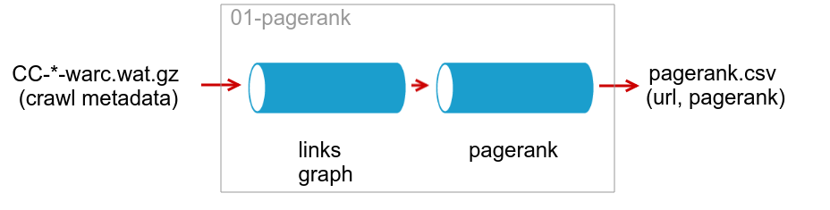
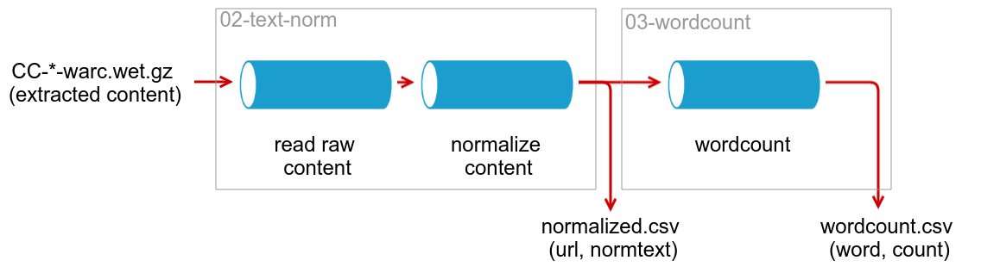

# Big Data Pipeline Workshop del [Dataday 2017](https://sg.com.mx/dataday/)
En este workshop se mostrarán algunos aspectos claves durante el diseño/implementación de un Data Pipeline con un proyecto sencillo.


## Requerimientos
Para el workshop es necesario lo siguiente:
* Sistema Operativo OSX o Linux
* [docker-engine](https://docs.docker.com/engine/installation/)
* [docker-compose](https://docs.docker.com/compose/install/) cli
* [aws](https://aws.amazon.com/cli/) cli
* make ([command line developer tools](https://developer.apple.com/downloads/index.action?=command%20line%20tools) en OSX o [gnu make](https://www.gnu.org/software/make/) en Linux).


## Set Up inicial
Teniendo instalados los requerimientos, crear las imagenes base de docker. Para ello ejecutar desde el root del proyecto:
```bash
$ make build
```

Posteriormente, descargar los datos de prueba desde S3:
```bash
$ make data
```

## Iniciar el cluster local
Para ejecutar los pipelines es necesario iniciar el cluster de hadoop localmente (en docker) y copiar los datos de prueba a hdfs:
```bash
$ make start
```

Copiar los datos de prueba a hdfs local:
```bash
$ make copy
```

Nota: Si sale el siguiente error:
```
Copying sample data to hdfs...
mkdir: Cannot create directory /app/data. Name node is in safe mode.
make: *** [.copied] Error 1
```
Es porque el cluster no había terminado de arrancar cuando se intentó copiar datos a hdfs. En dicho caso volver a ejecutar *make copy* anterior.


## Proyecto
Supongamos que el equipo de Data Science está investigando la forma de automatizar el etiquetado de documentos para evitar los errores humanos causados, principalmente, por el sesgo de editores. Para lo cual requieren la generación de los siguientes datasets a partir de una muestra de páginas web:

1. PageRank de páginas
2. Contenido en texto plano normalizado
3. Conteo de palabras


### Pipelines
La generación de estos datasets se puede dividir en los siguientes pipelines, ya que solo 3) es dependiente de la salida de 2), mientras que 1) es independiente:






#### Ejecutar pipeline: PageRank
Después de haber preparado los datos de prueba y tener el cluster local corriendo, ejecutar lo siguinte:
```bash
$ make pagerank
```

#### Ejecutar pipeline: Text Normalization
```bash
$ make textnorm
```

#### Ejecutar pipeline: Wordcount
```bash
$ make wordcount
```

#### Generar Datasets
Para generar los datasets requeridos por el equipo de DS, copiar desde hdfs a una ruta local. Para ello se puede usar el contenedor *client* de la siguiente forma:
```bash
$ make client
```

Lo anterior debió abrir una sesión dentro de un hadoop-client para poder ejecutar comandos hacia el cluster local:
```bash
root@9c9167bdd8f9:/app# hadoop fs -get /app/pagerank output/
root@9c9167bdd8f9:/app# hadoop fs -get /app/textnorm output/
root@9c9167bdd8f9:/app# hadoop fs -get /app/wordcount output/
```
Nota: el string *9c9167bdd8f9* es el id del contenedor.
Para salir de la sesión presionar ctrl+d

Los resultados de los pipelines se deben encontrar en la carpeta output/


## ToDo (mejoras)
* Agregar task para eliminar [stopwords](https://en.wikipedia.org/wiki/Stop_words).
* Agregar orquestación de pipelines ([oozie](http://oozie.apache.org/), [azkaban](https://azkaban.github.io/) o [luigi](https://github.com/spotify/luigi)).
* Agregar la persistencia (serving layer) al final de los pipelines (por ejemplo [hive](https://cwiki.apache.org/confluence/display/Hive/HCatalog+LoadStore)).
* Capa de deployment automatizado en la nube ([terraform](https://www.terraform.io/) o [juju](https://www.ubuntu.com/cloud/juju)).


## Dependencias
* [webarchive-commons](https://github.com/fcisneros/webarchive-commons)
* [warcutils](https://github.com/fcisneros/warcutils)
* [text-utils](https://github.com/fcisneros/text-utils)
